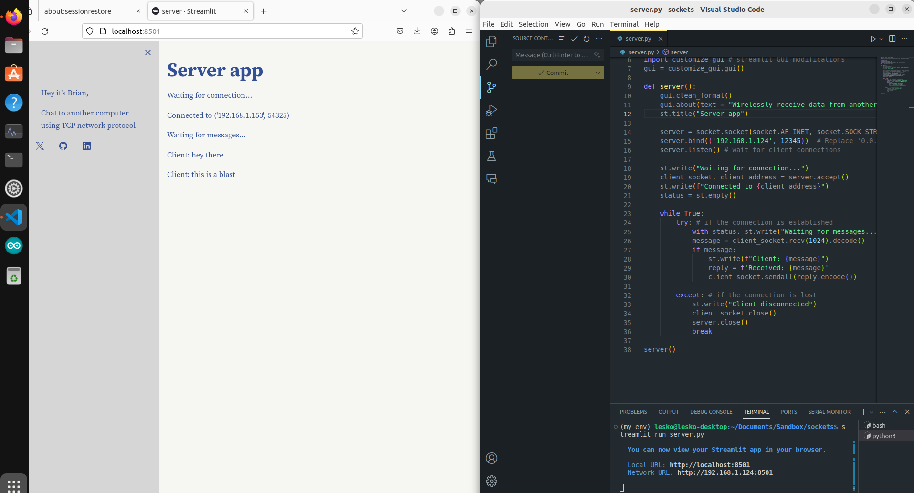

# Socket Stream(lit)
This code implements wireless socket communication between a server and client - written in pure python with a user interface for both computers. To recreate what ive done here you'll need two laptops and a network to communicate over. Make sure your IP addresses and subnet masks are correct and networkable. 



&nbsp;

## Local Computer Dependencies

This code uses the following libraries:
- `streamlit`: For creating the user interface
- `socket`: For handling the system level communication hardware 

&nbsp;

## Run this demo yourself

Clone the repository on two computers and install the necessary dependencies using pip. Next, run the streamlit apps in a terminal in the directory of the repositories

on the server computer:
``` 
streamlit run server.py
```

on the client computer:
``` 
streamlit run client.py
```

&nbsp;

## How it Works

The app as follows:
1. The server waits for a connection
2. The client connects to the server
3. The client waits for text input from the user
4. The client send the user data to the server
5. The server displays the data as text and responds with a received message
6. The server continually waits for another message
7. The client saves the socket connection but reruns and only displays the most recent message and server response

&nbsp;

## Topics 
```
Python | Wifi | wireless communication | sockets | TCP | networking 
decode bytes | communication | custom classes
Self taught coding | Mechanical engineer | Robotics engineer 
Brian Lesko | Brian Joseph Lesko
```
&nbsp;

<hr>

&nbsp;

<div align="center">


╭━━╮╭━━━┳━━┳━━━┳━╮╱╭╮        ╭╮╱╱╭━━━┳━━━┳╮╭━┳━━━╮
┃╭╮┃┃╭━╮┣┫┣┫╭━╮┃┃╰╮┃┃        ┃┃╱╱┃╭━━┫╭━╮┃┃┃╭┫╭━╮┃
┃╰╯╰┫╰━╯┃┃┃┃┃╱┃┃╭╮╰╯┃        ┃┃╱╱┃╰━━┫╰━━┫╰╯╯┃┃╱┃┃
┃╭━╮┃╭╮╭╯┃┃┃╰━╯┃┃╰╮┃┃        ┃┃╱╭┫╭━━┻━━╮┃╭╮┃┃┃╱┃┃
┃╰━╯┃┃┃╰┳┫┣┫╭━╮┃┃╱┃┃┃        ┃╰━╯┃╰━━┫╰━╯┃┃┃╰┫╰━╯┃
╰━━━┻╯╰━┻━━┻╯╱╰┻╯╱╰━╯        ╰━━━┻━━━┻━━━┻╯╰━┻━━━╯
  


&nbsp;


<a href="https://twitter.com/BrianJosephLeko"></a> &nbsp; &nbsp; &nbsp; &nbsp; &nbsp; &nbsp; <a href="https://github.com/BrianLesko"></a> &nbsp; &nbsp; &nbsp; &nbsp; &nbsp; &nbsp; <a href="https://www.linkedin.com/in/brianlesko/"></a>

follow all of these or i will kick you

</div>


&nbsp;


